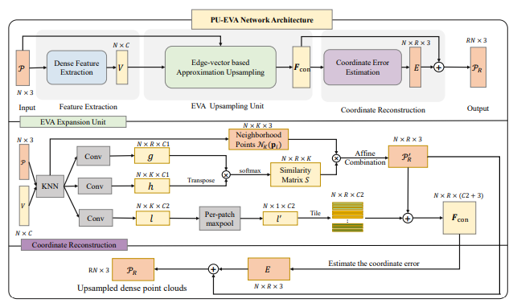

# PU-Transformer-pytorch
Pytorch unofficial implementation of PU-EVA

(PU-EVA: An Edge Vector based Approximation Solution for Flexible-scale Point Cloud Upsampling)

https://arxiv.org/abs/2204.10750

# Model Structure
**Model**

  

# Acknowledgement
This repo is heavily built on Point Transformer code.

https://github.com/POSTECH-CVLab/point-transformer
